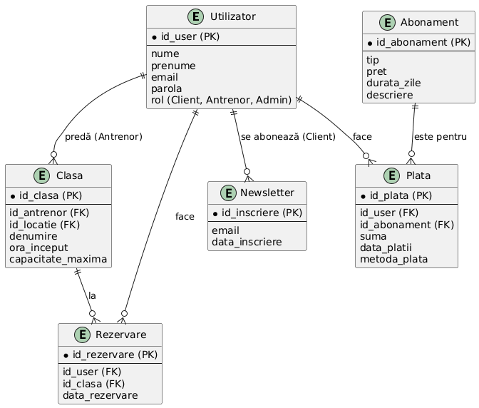
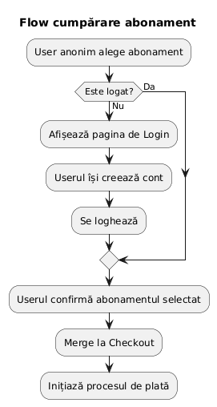
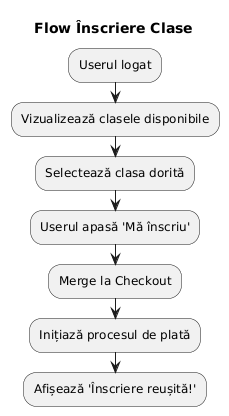
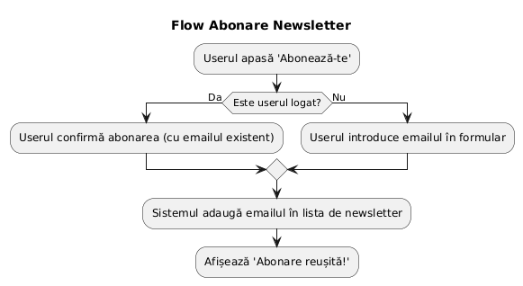

## 🧾 Proiect – „Sală de Fitness”

### 1️. Descriere generală

Aplicația web este o platformă centralizată pentru managementul sălilor de sport care pot avea multiple locații. Sistemul permite managementul utilizatorilor într-o singură entitate, permițând administrarea eficientă a claselor, abonamentelor și comunicării prin newsletter.

-----

### 2. Roluri user

| Rol | Descriere |
| :--- | :--- |
| **Client** | Cumpără abonamente, face rezervări la clase |
| **Antrenor** | Gestionează clasele |
| **Administrator** | Gestionează datele |

-----

### 3. Entități

| Entitate | Descriere | Atribute principale |
| :--- | :--- | :--- |
| **Utilizatori** | Entitatea de bază pentru toți userii | `id_user`, `nume`, `email`, `parola`, `rol` ('client', 'antrenor', 'admin') |
| **Abonamente** | Tipurile de abonamente oferite (lunar, etc.) | `id_abonament`, `tip`, `pret`, `durata_zile` |
| **Plati** | **Înregistrează tranzacțiile pentru abonamente** | `id_plata`, `id_user` (FK), `id_abonament` (FK), `suma`, `data_platii` |
| **Clase** | Sesiunile de antrenament programate | `id_clasa`, `id_antrenor` (FK), `denumire`, `ora_inceput`, `capacitate_maxima` |
| **Rezervari** | **Înscrierile clienților la clasele de fitness** | `id_rezervare`, `id_user` (FK), `id_clasa` (FK), `data_rezervare` |
| **Newsletter** | Lista de emailuri pentru comunicare | `id_inscriere`, `email`, `data_inscriere` |

-----

### 4. Diagrama BD

----

### 5. Diagrame UML

